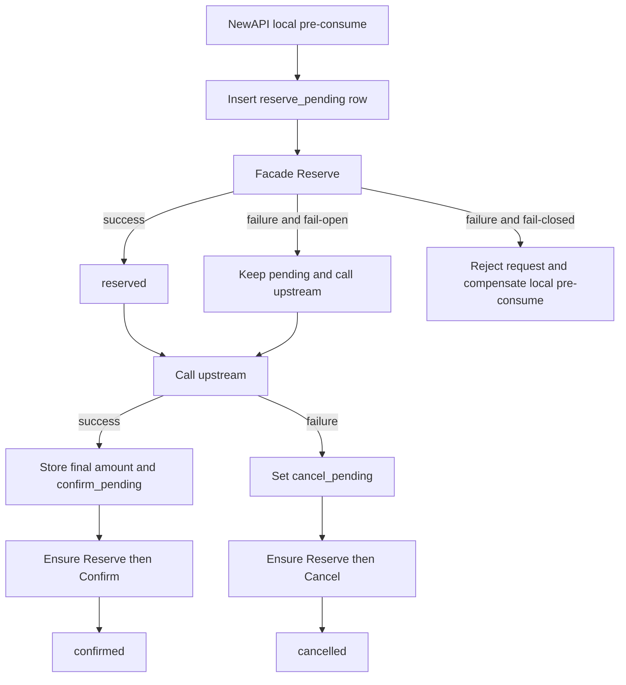

# Wallet Callback Double-Charge Integration

## Scope

NewAPI keeps its existing local wallet/subscription deduction and additionally sends the same API usage charge to Wallet through Facade. This is an intentional transition mode. `wallet_usage_callbacks` is a delivery lifecycle table, not another accounting ledger.

The integration applies to synchronous API billing sessions. `RelayInfo.RequestId` is used as Wallet's `api_request_id` for Reserve, Confirm, Cancel, retries, and idempotency.

## Configuration

| Variable | Default | Meaning |
| --- | --- | --- |
| `WALLET_CALLBACK_BASE_URL` | empty | Facade base URL. An empty value disables callbacks. |
| `WALLET_CALLBACK_ENABLED` | enabled when base URL is set | Explicit callback switch. Set `false` to disable without removing the URL. |
| `WALLET_CALLBACK_FAIL_CLOSED` | `false` | When `true`, a synchronous Reserve failure rejects the API request and rolls back NewAPI's local pre-consume. |
| `WALLET_CALLBACK_TIMEOUT_MS` | `3000` | Timeout for one callback attempt. |
| `WALLET_CALLBACK_TOKEN` | empty | Optional Bearer token forwarded to Facade. Facade must validate it before this provides authentication. |

Confirm and Cancel failures never change the already produced upstream result. They remain pending and are retried in the background. `WALLET_CALLBACK_FAIL_CLOSED` therefore applies only to the initial Reserve.

## Amount Conversion

NewAPI quota is USD-denominated and Wallet stores signed integer micro-CNY:

```text
amount_micro_cny = round(
    quota * usd_cny_rate * 1,000,000 / QuotaPerUnit
)
```

The conversion uses decimal arithmetic and half-away-from-zero rounding. A positive quota that rounds below one micro-CNY becomes one micro-CNY. Reserve snapshots the current `USDExchangeRate`; Confirm always reuses the stored snapshot.

## Lifecycle



If Reserve was unavailable but the request continued, a later Confirm or Cancel changes the target state. The retry worker always completes Reserve first, then sends the target action. This preserves Wallet's state machine and exact payload idempotency.

## Retry Rules

The master NewAPI process scans due rows every ten seconds in batches of 100. Failed attempts use delays of 1 second, 5 seconds, 30 seconds, 2 minutes, then 10 minutes for subsequent retries. Wallet endpoints are idempotent by `api_request_id`, so duplicate delivery after a timeout is expected.

Statuses are:

```text
reserve_pending -> reserved
reserve_pending/reserved -> confirm_pending -> confirmed
reserve_pending/reserved -> cancel_pending -> cancelled
```

`last_error`, `retry_count`, and `next_retry_at_ms` support diagnosis and recovery. A successful HTTP response followed by a local database write failure is also safe: the row remains pending and the same callback is sent again.

## Deployment Notes

NewAPI's normal GORM migration includes the model for SQLite, MySQL, and PostgreSQL compatibility. The local PostgreSQL migration is also available at `deploy/newapi-local/migrations/20260821_create_wallet_usage_callbacks.postgres.sql` for explicit deployment.

Before production, Facade must authenticate the internal callback routes. `business_order_no` is intentionally not populated yet because NewAPI has no trusted parent-order context in the current relay request.
